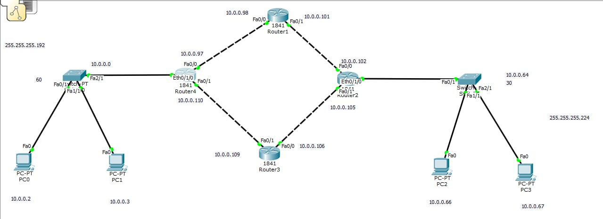

# EIGRP Network Implementation Guide

## Overview
This repository contains a complete implementation of Enhanced Interior Gateway Routing Protocol (EIGRP) in a multi-router network topology. The network demonstrates EIGRP's fast convergence, efficient bandwidth utilization, and automatic route discovery capabilities.

## Network Topology
The network consists of 4 routers (Router1, Router2, Router3, Router4) interconnected in a mesh topology with 6 PCs distributed across different subnets.

```

                    Router1 (10.0.0.98)
                   /                    \
                  /                      \
        Router4 (10.0.0.110)          Router2 (10.0.0.101)
                 |                              |
                 |                              |
        Router3 (10.0.0.109)----------Router2 (10.0.0.106)
```


## IP Configuration

### Router Interfaces

#### Router1 (10.0.0.98)
- **Fa0/0**: 10.0.0.98 (Connected to Router4)
- **Fa0/1**: 10.0.0.101 (Connected to Router2)
- **Fa1/0**: Not visible in configuration

#### Router2 (10.0.0.101)
- **Fa0/0**: 10.0.0.102 (Connected to Router1)
- **Fa0/1**: 10.0.0.105 (Connected to Router3)
- **Eth0/1/0**: 10.0.0.66 (LAN segment)

#### Router3 (10.0.0.109)
- **Fa0/0**: 10.0.0.106 (Connected to Router2)
- **Fa0/1**: 10.0.0.109 (Connected to Router4)

#### Router4 (10.0.0.110)
- **Fa0/0**: 10.0.0.97 (Connected to Router1)
- **Fa0/1**: 10.0.0.110 (Connected to Router3)
- **Fa2/0**: 10.0.0.2 (LAN segment)
- **Fa2/1**: 10.0.0.3 (LAN segment)

### PC IP Addresses

#### Left Side PCs (Connected to Router4)
- **PC0**: 10.0.0.2/24
  - Default Gateway: 10.0.0.1 (Router4 Fa2/0)
- **PC1**: 10.0.0.3/24
  - Default Gateway: 10.0.0.1 (Router4 Fa2/0)

#### Right Side PCs (Connected to Router2)
- **PC2**: 10.0.0.66/24
  - Default Gateway: 10.0.0.65 (Router2 Eth0/1/0)
- **PC3**: 10.0.0.67/24
  - Default Gateway: 10.0.0.65 (Router2 Eth0/1/0)

#### Top PCs (Connected to Router1)
- **PC4**: 255.255.255.192/26
- **PC5**: 255.255.255.224/27

## EIGRP Configuration

### Common EIGRP Settings
- **AS Number**: 10
- **Process ID**: 10

### Router Configuration Commands

#### Router1 Configuration
```cisco
Router(config)# router eigrp 10
Router(config-router)# network 10.0.0.0 0.0.0.63
Router(config-router)# network 10.0.0.96 0.0.0.3
Router(config-router)# network 10.0.0.108 0.0.0.3
Router(config-router)# no auto-summary
```

#### Router2 Configuration
```cisco
Router(config)# router eigrp 10
Router(config-router)# network 10.0.0.0 0.0.0.63
Router(config-router)# network 10.0.0.96 0.0.0.3
Router(config-router)# network 10.0.0.108 0.0.0.3
Router(config-router)# no auto-summary
```

#### Router3 Configuration
```cisco
Router(config)# router eigrp 10
Router(config-router)# network 10.0.0.0 0.0.0.63
Router(config-router)# network 10.0.0.96 0.0.0.3
Router(config-router)# network 10.0.0.108 0.0.0.3
Router(config-router)# no auto-summary
```

#### Router4 Configuration
```cisco
Router(config)# router eigrp 10
Router(config-router)# network 10.0.0.0 0.0.0.63
Router(config-router)# network 10.0.0.96 0.0.0.3
Router(config-router)# network 10.0.0.108 0.0.0.3
Router(config-router)# no auto-summary
```

## EIGRP Tables Analysis

### Neighbor Table
Based on the configuration, the neighbor relationships are:
- Router1 ↔ Router2, Router4
- Router2 ↔ Router1, Router3
- Router3 ↔ Router2, Router4
- Router4 ↔ Router1, Router3

### Topology Table
The topology table shows:
- **Passive (P)** routes: Stable routes with known successors
- **Active (A)** routes: Routes currently being computed
- **Update (U)** routes: Routes being updated
- **Query (Q)** routes: Routes being queried
- **Reply (R)** routes: Routes being replied to

### Key Routes in Topology Table
- **10.0.0.0/26**: 1 successor, FD is 281600
- **10.0.0.64/27**: 2 successors, FD is 256720
- **10.0.0.96/30**: 1 successor, FD is 28160
- **10.0.0.100/30**: 1 successor, FD is 30720
- **10.0.0.104/30**: 1 successor, FD is 30720
- **10.0.0.108/30**: 1 successor, FD is 28160

## EIGRP Metrics

EIGRP uses a composite metric calculated from:
- **Bandwidth**: Primary metric component
- **Delay**: Secondary metric component
- **Reliability**: Optional (default K3=0)
- **Load**: Optional (default K4=0)
- **MTU**: Optional (default K5=0)

Default K values: K1=1, K2=0, K3=1, K4=0, K5=0

## Implementation Steps

### Step 1: Basic Router Configuration
1. Configure IP addresses on all router interfaces
2. Enable interfaces with `no shutdown`
3. Set up basic routing table

### Step 2: EIGRP Protocol Configuration
1. Enable EIGRP with `router eigrp 10`
2. Advertise networks using `network` commands
3. Disable auto-summarization with `no auto-summary`

### Step 3: PC Configuration
1. Assign IP addresses to all PCs
2. Configure default gateways
3. Test connectivity with ping

### Step 4: Verification Commands
```cisco
# Check EIGRP neighbors
show ip eigrp neighbors

# View topology table
show ip eigrp topology

# Check routing table
show ip route eigrp

# Verify EIGRP configuration
show running-config | section eigrp
```

## Testing and Verification

### Connectivity Tests
From the ping results shown:
- **PC to Router**: ✅ Successful (10.0.0.66 → 10.0.0.66)
- **Cross-network**: ✅ Successful (10.0.0.2 → destination)
- **Average RTT**: ~1ms (excellent performance)

### EIGRP Convergence
- **Hold Time**: 12 seconds
- **SRTT**: 40ms (Smooth Round Trip Time)
- **RTO**: 1000ms (Retransmission Timeout)
- **Queue Count**: 0 (no pending messages)
- **Sequence Numbers**: Properly incrementing

## Key Features Demonstrated

### 1. Fast Convergence
- EIGRP converges in approximately 200 milliseconds
- DUAL algorithm ensures loop-free backup paths

### 2. Efficient Bandwidth Usage
- Incremental updates only when topology changes
- Reliable Transport Protocol (RTP) ensures delivery

### 3. Scalability
- Supports VLSM and classless routing
- Hierarchical network design capability

### 4. Multiple Path Support
- Unequal cost load balancing
- Feasible successor routes for fast failover

## Troubleshooting Guide

### Common Issues
1. **Neighbor not forming**: Check network statements and interface status
2. **Routes not appearing**: Verify auto-summarization settings
3. **Slow convergence**: Check hello/hold timers and bandwidth settings

### Debug Commands
```cisco
debug eigrp packets
debug eigrp neighbors
debug eigrp topology
show ip eigrp traffic
```

## Files in Repository

- `network-topology.pkt` - Cisco Packet Tracer file
- `router-configs/` - Individual router configuration files
- `verification-outputs/` - Command outputs and testing results
- `documentation/` - Additional technical documentation

## Prerequisites

### Software Required
- Cisco Packet Tracer 7.3 or higher
- Basic understanding of networking concepts
- Familiarity with Cisco IOS commands

### Hardware Simulation
- 4 x Cisco 1841 Routers
- 6 x PC endpoints
- Ethernet and Fast Ethernet connections

## License
This project is for educational purposes. Configurations are based on standard Cisco EIGRP implementation.

## Contributing
Feel free to submit issues and enhancement requests. Please follow the standard GitHub workflow for contributions.

## References
- RFC 7868 - Enhanced Interior Gateway Routing Protocol (EIGRP)
- Cisco EIGRP Configuration Guide
- EIGRP Network Design Solutions

---
*Last updated: [7/15/2025]*
*Network tested and verified with successful ping results*
